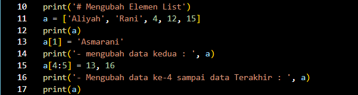
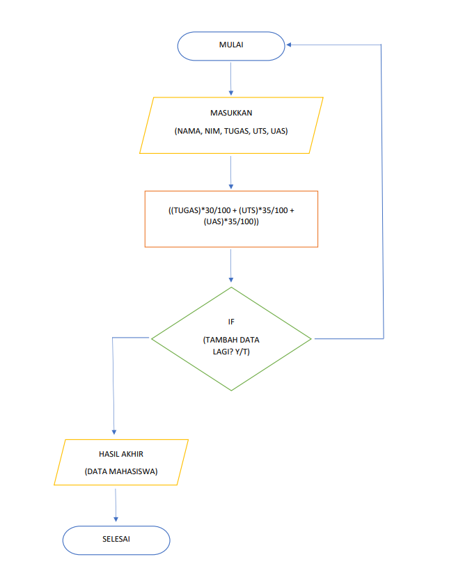
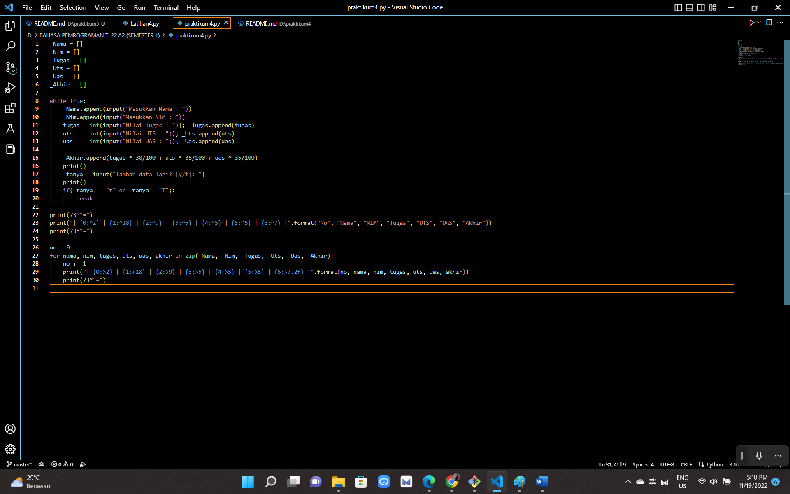

# ASSALAMU'ALAIKUM WR.WB

# pertemuan9 

# Latihan

# Akses List
    - Tampilkan Elemen Ke-3
    - Mengambil Nilai Elemen Ke-2 Sampai Elemen Ke-4
    - Mengambil Elemen Terakhir

## SOURCE CODE


## PENJELASAN
1. Membuat list sebanyak 5 elemen dengan nilai bebas
```
r = [ 9, 8, 7, 6, 5 ]
```
2. Menampilkan elemen ke-3
```
print('- Elemen ke-3 : ', r[3])
```
3. Jika ingin mengambil elemen ke-2 sampai elemen ke-4 dapat menggunakan `r[2:5]`
```
print('- Nilai Elemen Ke-2 Sampai Elemen ke-4 : ', r[2:5])
```
4. Jika ingin mengambil elemen terakhir dapat menggunakan `r[-1]`
```
print('- Elemen Terakhir : ', r[-1])
```

## OUTPUT


# Mengubah Elemen List
    - Ubah Elemen Ke-4 Dengan Nilai Lain
    - Ubah Elemen Ke-4 Sampai Dengan Elemen Terakhir

## SOURCE CODE


## PENJELASAN
1. Membuat list sebanyak 5 elemen dengan nilai bebas
```
a = ['Aliyah', 'Rani', 4, 12, 15]
```
2. Jika ingin mengubah elemen ke-4 dapat menggunakan `a[1] = 'Asmarani'`
```
print('- mengubah data kedua : ', a)
```
3. Jika ingin mengubah elemen ke-4 sampai dengan elemen terakhir dapat menggunakan `a[4:5] = 13, 16`
```
print('- Mengubah data ke-4 sampai data Terakhir : ', a)
```

## OUTPUT


# Menambahkan Elemen List
    - Ambil 2 Bagian Dari List Pertama (A) Dan Jadikan List Ke-2 (B)
    - Tambah List B Dengan Nilai String
    - Tambah List B Dengan 3 Nilai
    - Gabungkan List B Dengan List A

## SOURCE CODE


## PENJELASAN
1. Ambil 2 Bagian Dari List Pertama (A) Dan Jadikan List Ke-2 (B)
```
n = ['Kelinci', 'Kucing', 'Katak', 'Kangguru', 'Koala']
print(n)
A = n[0:2]
B = n[2:]
print(A)
print(B)
```
2. Jika ingin menambahkan list B dengan nilai string dapat menggunakan `B.append('Harimau')`
```
B.append('Harimau')
print('- Menambahkan List B Dengan Nilai String : ', B)
```
3. Jika ingin menambahkan list B dengan 3 nilai dapat menggunakan `B.extend([1, 2, 3])`
```
B.extend([1, 2, 3])
print('- Menambahkan List B Dengan 3 Nilai : ', B)
```
4. Untuk menggabungkan list B dengan list A dapat menggunakan `B.extend(A)`
```
B.extend(A)
print('- Menggabungkan List B Dengan List A : ', B) 
```

## OUTPUT


# Tugas Praktikum 

# Program Sederhana Untuk Menambahkan Data Kedalam Sebuah List

## SOURCE CODE & FLOWCHART



## PENJELASAN 
1. Mendaklarasi list
```
_Nama = []
_Nim = []
_Tugas = []
_Uts = []
_Uas = []
_Akhir = []
```
2. Gunakan perulangan while loop dengan nilai "True"
```
while True:
```
3. Menginput Nama, Nim, Tugas, Uts, Uas, dan Akhir dengan menambahkan method `.append`
```
_Nama.append(input("Masukkan Nama : "))
    _Nim.append(input("Masukkan NIM : "))
    tugas = int(input("Nilai Tugas : ")); _Tugas.append(tugas)
    uts   = int(input("Nilai UTS : ")); _Uts.append(uts)
    uas   = int(input("Nilai UAS : ")); _Uas.append(uas)

    _Akhir.append(tugas * 30/100 + uts * 35/100 + uas * 35/100)
    print()
```
4. Pada input Tambah Data Lagi? apabila jawaban "t" atau "T", maka program akan berhenti dan akan menampilkan hasil daftar datanya
```
_tanya = input("Tambah data lagi? [y/t]: ")
    print()
    if(_tanya == "t" or _tanya =="T"):
        break
```
5. Untuk membuat header table, menggunakan `print(73*"=")`, fungsinya membuat "=" sebanyak 73 sebagai garis, dan menggunakan format string
```
print(73*"=")
print("| {0:^2} | {1:^18} | {2:^9} | {3:^5} | {4:^5} | {5:^5} | {6:^7} |".format("No", "Nama", "NIM", "Tugas", "UTS", "UAS", "Akhir"))
print(73*"=")
```
6. Deklarasi `no = 0` untuk membuat nomor pada isi tabel, lalu membuat prulangan dengan `for`
    - perulangan `nama, nim, tugas, uts, uas, akhir `, sesuai urutan yang ada di dalam `zip`
    - Pada list yang dimaksud, `in zip` berfungsi untuk membungkus semua list
```
no = 0
for nama, nim, tugas, uts, uas, akhir in zip(_Nama, _Nim, _Tugas, _Uts, _Uas, _Akhir):
```
7. Membuat isi tabel sesuai keinginan dengan format string
```
no += 1
    print("| {0:>2} | {1:<18} | {2:>9} | {3:>5} | {4:>5} | {5:>5} | {6:>7.2f} |".format(no, nama, nim, tugas, uts, uas, akhir))
```
8. Untuk membuat footer atau garis paling bawa ketika looping isi tabel selesai
```
 print(73*"=")
 ```

## OUTPUT


# WASSALAMU'ALAIKUM WR.WB

